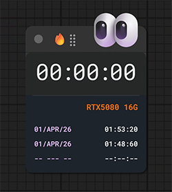
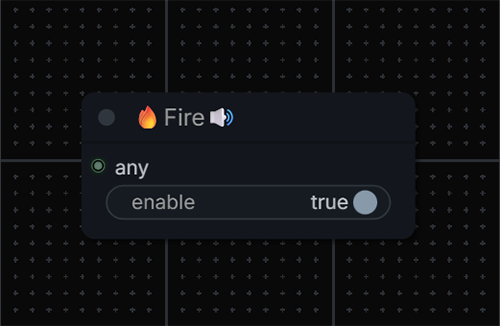
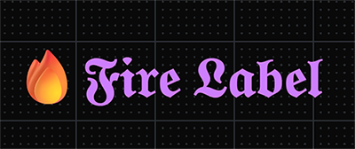

# ComfyUI RectumFire

**Languages:** **English** | [简体中文](README.zh-CN.md)

RectumFire is a small ComfyUI utility pack for solving everyday workflow pain.

This is not a pack of niche one-off tricks.
It is a pack of nodes for the problems that come back all the time:
- broken imported workflows
- missing model selections
- ugly or cluttered routing
- no runtime feedback
- no good visual preview from subgraphs

That is why it is called `RectumFire`.

## What Is In This Pack

- `Fire Resolve`
- `Fire Copy`
- `Fire Note`
- `Fire Banner`
- `Fire Switch`
- `Fire Timer`
- `Fire Done`
- `Fire Label`

## Installation

Put this repository into `ComfyUI/custom_nodes/`.

If you use git:

```bash
cd ComfyUI/custom_nodes
git clone https://github.com/vladgohn/ComfyUI-RectumFire.git
```

Then restart ComfyUI.

## The Core Of RectumFire

RectumFire started from one problem:
you open someone else's workflow, and it breaks because models are missing, renamed, or stored under different paths.

Without tooling, fixing that is slow and irritating.
RectumFire turns it into a simple loop:

1. try to auto-fix
2. extract what is missing
3. keep the repair info inside the graph

## Fire Resolve

Hotkey: `Shift + Alt + R`

`Fire Resolve` is the fastest way to repair broken imported workflows.

Select a node, press the hotkey, and if the needed model exists in your available options, the node tries to relink it automatically.

The value is simple:
- less manual searching
- less typing
- less stupid repair work

## Fire Copy

Hotkey: `Shift + Alt + C`

If `Fire Resolve` cannot repair the node automatically, `Fire Copy` pulls out the useful references for you.

Usually that means model filenames.
If not, it falls back to a compact JSON snapshot of the node.

This matters because even when auto-fix fails, you still get the exact data you need without digging through workflow files by hand.

## Fire Note

Hotkey for paste: `Shift + Alt + V`

`Fire Note` is where the repair context lives.

After copy, paste creates a note near the cursor and inserts the collected info directly into the workflow.
Found models are marked with `✅`, missing ones with `❌`.

That makes the next step much faster:
- you instantly see what exists locally
- you instantly see what is missing
- you can copy missing filenames into model archive search without guessing

These three are meant to be used together.
They are the foundation of the whole pack.

## Fire Banner


`Fire Banner` is the killer feature of this pack.

ComfyUI subgraphs still have a major usability problem: getting visual information out of them in a practical way.
`Fire Banner` solves that by surfacing preview information outward, which makes subgraphs much easier to monitor and debug.

This is not just decoration.
If you use modular or nested workflows, this is genuinely useful every day.

> **Important**
> The old frontend behavior is fine, but the newer ComfyUI frontend/subgraph changes made `Fire Banner` unstable and sometimes unpredictable.
> Right now that is an upstream frontend problem, not a finished redesign of this node.
> Once that frontend behavior settles down, `Fire Banner` will be adjusted to match it properly.

## Fire Switch


`Fire Switch` is an `ANY` switch for interchangeable branches.

Nodes like this already exist, but this version fixes one annoying issue: ghost inputs that stay behind after disconnecting or reworking links.

The point of this node is not novelty.
The point is cleaner behavior and less graph trash.

Known limitation for now:
this node currently switches by selected index.
It does not yet mirror the behavior of `Switch (Any)` where muting one source lets the next available source take over automatically.

That behavior is known, planned, and not implemented yet.

## Quality-Of-Life Utilities

## Fire Timer



`Fire Timer` is a runtime clock you actually want to keep on the canvas.

It gives immediate visual feedback that a workflow is running, keeps the final elapsed time visible when execution ends, and does it with a UI that is intentionally more stylish than a plain debug widget.

The expanded timer drawer now also keeps the last three runs inside the workflow:
- final render time
- render date
- GPU name and VRAM used for that run

That matters when you come back to a workflow later, compare runs, or share it with someone else.
`20 seconds` is much more useful when you can also see which GPU produced that result.

This is one of those nodes that becomes hard to live without once you start using it.

## Fire Done



`Fire Done` is a simple completion bell.

It exists because "queue finished" is not always the same thing as "the branch I care about actually finished."
Put it at the exact point that matters, and it gives you a visible and audible signal.

If you already know `PlaySound` from `Custom Scripts`, this node fills a similar role.
The difference is that `Fire Done` is intentionally simpler, lighter, and comes with a different default sound.

This version is intentionally simpler than some alternatives.
No bloated sound-picker UI, no extra overdesign.
If you want another sound, replace `js/assets/done.wav`.

## Fire Label



`Fire Label` makes gothic-style headings directly in the graph.

It is not about raw functionality.
It is about making big workflows easier and nicer to read.
It looks good, it is lightweight, and it does not depend on installing a custom font.

## Notes

- The backend nodes exported by the pack are `Fire Timer`, `Fire Done`, `Fire Note`, `Fire Switch`, and `Fire Banner`.
- `Fire Label`, `Fire Copy`, and `Fire Resolve` are frontend tools/extensions.
- `fire_route.py` exists in the repository but is not currently exported as an active node.

## Troubleshooting

### Nodes do not appear

- make sure the repository is inside `ComfyUI/custom_nodes/`
- restart ComfyUI fully
- check ComfyUI console for import errors

### Fire Done does not play sound

- make sure the node actually executed
- make sure `enable` is on
- interact with the browser tab first if autoplay is blocked

### Fire Resolve does nothing

- select the node first
- use `Shift + Alt + R`
- it can only auto-fix models that already exist in your available options

### Fire Banner does not show preview

- make sure an image is connected
- make sure the branch actually executed
- make sure ComfyUI temp output is writable

## License

This repository is licensed under [Apache-2.0](LICENSE).
Attribution is preserved through the license and the included [NOTICE](NOTICE) file.

## Support

If RectumFire saves you time, you can support the project through GitHub Sponsors:

- [Sponsor on GitHub](https://github.com/sponsors/vladgohn)

If you need paid help, the best fit is:
- ComfyUI workflow repair
- workflow cleanup and graph UX improvement
- subgraph observability / utility-node integration
