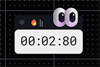
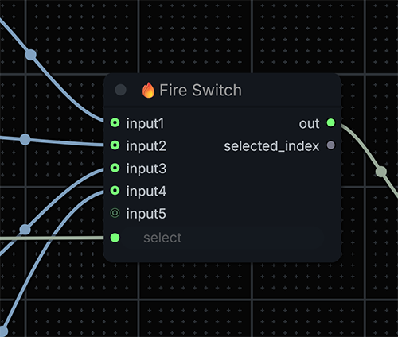
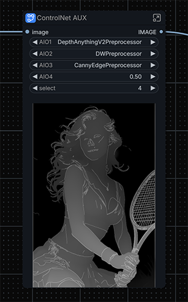

# ComfyUI RectumFire

RectumFire is a UX-focused custom node pack for ComfyUI.
It adds utility/output nodes and frontend enhancements that make long workflows easier to monitor, debug, and operate.

### Why the name "RectumFire"
The name is intentionally raw: it reflects the pain many of us hit in real ComfyUI work when basic workflow UX tools are missing.  
RectumFire is an attempt to reduce that pain with practical, no-nonsense nodes and frontend helpers that make daily use faster and less frustrating.

This repository is optimized for practical workflow quality-of-life:
- visual run timer with animated compact UI
- "done" output node with optional completion sound
- lightweight text note node for inline documentation
- dynamic ANY-type switch node (up to 32 inputs)
- image banner preview node useful for promoted subgraph widgets
- extra frontend hotkeys/utilities for copy/paste and path resolve helpers

## What You Get

### Exported Python Nodes (loaded by `__init__.py`)

These are the nodes currently registered in ComfyUI from this repo:

1. `RectumFireTimer` (`🔥Fire Timer`)
2. `RectumFireDone` (`🔥Fire🔊`)
3. `RectumFireNote` (`🔥Fire Note`)
4. `RectumFireSwitch` (`🔥Fire Switch`)
5. `RectumFireBanner` (`🔥Fire Banner`)

## Installation

1. Clone or copy this repository into your ComfyUI custom nodes folder:
   - `ComfyUI/custom_nodes/comfyui_rectumfire`
2. Restart ComfyUI.
3. Confirm nodes appear in the Add Node menu under categories starting with `RectumFire/...`.

No Python dependency installation is required beyond normal ComfyUI environment requirements.

## Node Guide

## 1) Fire Timer (`RectumFireTimer`)

Category: `RectumFire/UI`  
Type: output/UI execution indicator

### Why this node exists
Use it as a compact real-time run clock for queue execution. It gives immediate visual feedback that the graph is running and shows live runtime (`MM:SS:CS`).

### Behavior and features
- Starts on `execution_start` event.
- Stops/freeze on:
  - execution end (`executing` with `detail === null`)
  - execution error
  - interruption
- Keeps final elapsed value visible when run ends.
- Resets only on the next run start (not on stop).
- Draws custom canvas UI with:
  - blinking colons
  - theme transition between running/stopped states
  - animated title glyph while running
  - animated moving eyes overlay (`js/assets/Eyes.png`, `js/assets/Pupil.png`)

### Usage notes
- Place anywhere as a dashboard/status element.
- It is an output node (`OUTPUT_NODE = True`), so it can serve as an execution endpoint.
- Multiple timer nodes are synchronized by shared frontend timer state.

## 2) Fire Done (`RectumFireDone`)

Category: `RectumFire/UX`  
Type: output completion notifier

### Why this node exists
Use this as an explicit "completion bell" endpoint in important branches (e.g., final image save branch), so you know when that branch really executed.

### Inputs
- `any` (ANY): execution trigger input.
- `enable` (BOOLEAN): turn notification on/off.

### Behavior and features
- Has no outputs by design.
- Emits UI signal `rf_done` when executed and enabled.
- Frontend reacts by:
  - changing node title to `💯`
  - playing `js/assets/done.mp3` (volume 0.3)
- Title is restored automatically when a new queue starts.

### Usage notes
- Connect it only where "done" should mean done.
- If `enable = false`, node is effectively silent/no-op.
- Browser audio policies may require prior user interaction with page for autoplay.

## 3) Fire Note (`RectumFireNote`)

Category: `Fire`  
Type: utility note node

### Why this node exists
Use it as an in-graph text scratchpad for prompts, TODOs, model notes, reproducibility metadata, or experiment logs.

### Behavior and features
- Simple multiline string widget.
- No outputs and no compute cost impact.
- Supports keyboard-driven creation/paste via frontend helpers.

### Usage notes
- Ideal for keeping context inside workflow JSON.
- Works well with RectumFire copy/paste hotkeys (see Hotkeys section).

## 4) Fire Switch (`RectumFireSwitch`)

Category: `RectumFire/Utils`  
Type: dynamic ANY selector

### Why this node exists
Use it to collect a set of equivalent `ANY` inputs and switch between them without rewiring downstream nodes.

The main idea is simple: build one interchangeable collection of incoming `ANY` streams, select the active one, and keep a single `ANY` output flow for the rest of the graph.

### Inputs/Outputs
- Required input:
  - `select` (INT, 1..32)
- Optional inputs:
  - `input1`..`input32` (ANY)
- Outputs:
  - `out` (ANY): selected input value
  - `selected_index` (INT): normalized chosen index

### Behavior and features
- Backend clamps `select` to `[1, 32]`.
- Frontend extension auto-manages visible input slots:
  - keeps contiguous `input1..inputN`
  - target slot count is `connected + 1` (min 2, max 32)
  - updates select widget max to connected range
- Missing selected input returns `None` (Python `None` propagated).

> **Killer feature: Ghost-port cleanup**
> Defensive slot normalization prevents stale/ghost input ports after disconnects.
> It removes only trailing unused slots, disconnects before removal, validates links against `graph.links`, and re-normalizes on add/configure/connection-change/serialize events.

### Usage notes
- Best used when all candidate inputs are interchangeable alternatives for the same downstream path.
- Typical pattern: aggregate multiple branch variants into the switch, control `select`, and keep one stable `out` connection further in the pipeline.
- Keep one extra empty slot ready for quick extension.

## 5) Fire Banner (`RectumFireBanner`)

Category: `RectumFire/Test`  
Type: output preview bridge for widget promotion/subgraphs

### Why this node exists
Use it when you want an image preview represented through a string widget (`rf_banner`) and visible when that widget is promoted to parent subgraphs.

This is primarily a **planned/prototype direction** for ComfyUI subgraph UX:
- expose an inner image preview outside the subgraph boundary
- make the parent subgraph node visually informative without opening it
- reduce blind debugging when a nested branch is selected or switched

### Inputs
- `rf_banner` (STRING): anchor widget (mainly for promotion target).
- `image` (IMAGE): image source used to generate preview.

### Behavior and features
- Saves incoming image as temporary PNG in ComfyUI temp directory.
- Returns UI payload (`rf_banner_preview`) with temp file metadata.
- Frontend patches `rf_banner` widget into image renderer.
- Supports propagation to parent subgraph nodes by listening to `widget-promoted` event.

### Usage notes
- This node is primarily UX glue for subgraph/widget workflows.
- It is output-only and returns no backend tensor outputs.

### Why this is useful (community context)
Subgraph workflows are becoming more common, but observability is still a pain point. Fire Banner targets that gap:

- Official ComfyUI extension docs explicitly call out `Widget Promotion` events (`widget-promoted` / `widget-demoted`) and note the behavior is still evolving.
- The same docs emphasize separate node identifiers for UI state (including images), which shows preview state in nested graphs is a first-class but non-trivial concern.
- Multiple ComfyUI issues around subgraphs/group nodes report fragility and hard-to-debug behavior; showing preview on the parent node helps identify where a nested branch fails without drilling into each level.

In short: exposing subgraph previews externally is not just cosmetic; it improves debugging speed and operator confidence in large modular workflows.

References:
- ComfyUI docs, JavaScript objects/hijacking (`widget-promoted`, UI state object notes): https://docs.comfy.org/custom-nodes/js/javascript_objects_and_hijacking
- ComfyUI docs, core node concepts (`subgraphs`): https://docs.comfy.org/development/core-concepts/nodes
- ComfyUI issue #10522 (subgraph execution/maintenance pain in larger nested workflows): https://github.com/comfyanonymous/ComfyUI/issues/10522
- ComfyUI issue #7506 (preview visibility complaints during workflow execution): https://github.com/comfyanonymous/ComfyUI/issues/7506

## Frontend Utilities and Hotkeys

Beyond node rendering logic, this repo ships a unified recovery workflow for missing/broken model references.

### Fire Recovery System: `Copy + Resolve + Note`

This block is designed as one operational toolchain, not separate helpers:
- collect model-related references from nodes
- resolve broken/ambiguous path values against available combo options
- keep recovery notes directly in-graph for fast iteration and handoff

1. `Shift + Alt + C` (`fire_copy.js`) - Collect
   - Reads selected node and extracts model-like filenames when possible.
   - Falls back to copying a compact node JSON snapshot when no model strings are found.

> **Killer feature: JSON fallback copy**
> In many ComfyUI situations you cannot quickly inspect the exact node JSON fragment you need.
> `Fire Copy` solves this by falling back to a compact JSON snapshot, so you can instantly inspect/share/debug node state without digging through full workflow files.

2. `Shift + Alt + R` (`fire_resolve.js`) - Resolve
   - Attempts to remap current widget values to valid entries from combo lists.
   - Uses basename/stem matching heuristics to recover from path drift.
   - Marks node status and shows toast summary: fixed / already OK / failed / skipped.

3. `Shift + Alt + V` (`fire_copy.js` / `fire_note.js`) - Document
   - Pastes last collected payload into a new `RectumFireNote` near cursor.
   - Keeps repair context inside the workflow itself.

### Why this matters
- Missing model paths are one of the most common workflow breakpoints.
- This system reduces repair friction by combining search, auto-fix attempts, and inline documentation into one keyboard-driven loop.
- Result: faster recovery and better usability in large or shared workflows.

### Additional frontend tools

1. Fire Label (`fire_label.js`) - frontend-only visual title node
   - Virtual node registered only in frontend via `LiteGraph.registerNodeType` (no Python backend node).
   - Converts text into Unicode Mathematical Bold Fraktur, so you can place gothic-style headers directly inside the graph.
   - Supports styling controls: `fontSize`, `fontColor`, `textAlign`, `backgroundColor`, `borderRadius`, `letterSpacing`, `padding`.
   - Auto-fits node size to rendered text and supports multiline headings.
   - Best used as section/title markers for large workflows and subgraph dashboards.

2. Fire Toster (`fire_toster.js`) - internal message API
   - Reusable DOM toast engine used internally by RectumFire tools.
   - Public helper: `firetosterShow({ theme, title, sub, lifeMs })`.
   - Themes: `green`, `violet`, `magenta`.
   - Non-blocking overlay behavior (`pointer-events: none` on container/cards) with manual close button support.
   - Used by `fire_copy.js` and `fire_resolve.js` to display recovery status and action results.

## Assets

The following assets are used by frontend UX features:
- `js/assets/done.mp3`, `done.wav`: completion sound
- `js/assets/Eyes.png`, `Pupil.png`: timer overlay animation
- `js/assets/anim.gif`, `dummy.png`, `assets.zip`: utility/experimental assets

## Known Design Details

- `RectumFireDone` and `RectumFireTimer` are `OUTPUT_NODE = True` by design.
- `RectumFireBanner` uses `INPUT_IS_LIST = True` and handles batched tensor/image input safely.
- Timer UI logic is entirely frontend-driven; backend node only provides execution anchor.
- Some JS files are experimental or legacy (`fire_test.js`, `fire_sketch.js`) and are not core to production behavior.

## Non-exported Python Files in This Repo

The repository also contains Python modules not currently exported in `__init__.py`:
- `fire_mask.py` (`RectumFireMask`)
- `fire_route.py` (`RectumFireRoute`)

They are present in source but not active unless you explicitly register/import them in `__init__.py`.

## Compatibility

- Intended for ComfyUI frontend extension API (`app.registerExtension`, `api` event listeners).
- Works best on modern Chromium-based browsers where audio and clipboard APIs are available.

## Troubleshooting

1. Nodes do not appear
   - Verify folder name/location under `ComfyUI/custom_nodes/`.
   - Restart ComfyUI fully.
   - Check ComfyUI console for import errors.

2. No completion sound
   - Ensure `RectumFireDone` `enable` is true.
   - Ensure node executed in active branch.
   - Interact with browser tab first (autoplay policies).

3. Hotkeys do nothing
   - Ensure canvas has focus and you are not typing in input fields.
   - Confirm conflicting extensions are not intercepting the same shortcuts.

4. Banner preview missing
   - Verify `image` input is connected and produces valid image.
   - Confirm temp files are writable in ComfyUI temp directory.

## Recommended Workflow Patterns

1. Put `Fire Timer` near workflow header for constant visibility.
2. Place `Fire Done` at the final branch that represents "job complete".
3. Use `Fire Switch` for branch/model toggling during experiments.
4. Use `Fire Note` for reproducibility logs inside workflow JSON.
5. Use `Fire Banner` when building subgraphs with promoted UI widgets and visual status.

## License

Add your license section here before GitHub publication.
